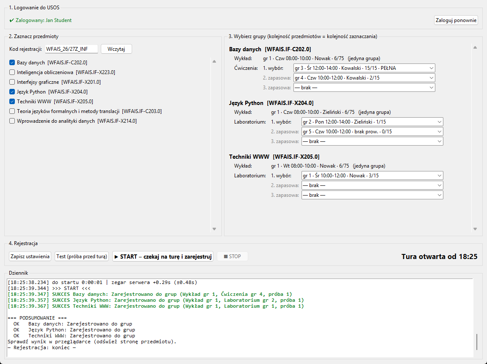
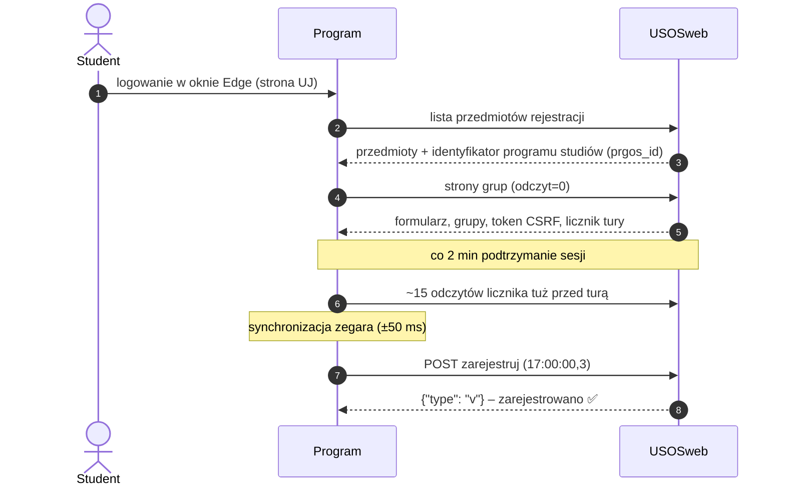
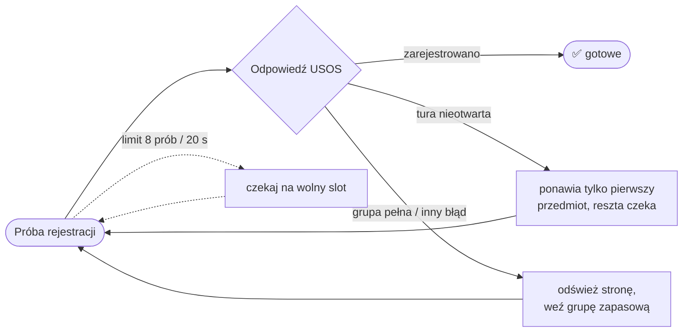

<div align="center">

# 🎓 USOS – automatyczna rejestracja do grup

**Zapisuje do wybranych grup w USOSweb UJ w ułamku sekundy po otwarciu tury „kto pierwszy”.**<br>
Okienko do wyklikania, logowanie przez stronę uczelni, synchronizacja zegara z serwerem i poszanowanie limitów USOS.




<sub>Zrzut z atrapy USOSweb – fikcyjny student i prowadzący.</sub>

</div>

---

## 📑 Spis treści

- [Co potrafi](#-co-potrafi)
- [Jak to działa](#-jak-to-działa)
- [Synchronizacja zegara](#-synchronizacja-zegara)
- [Ciekawe problemy po drodze](#-ciekawe-problemy-po-drodze)
- [Instalacja](#-instalacja)
- [Użycie](#-użycie)
- [Testy](#-testy)
- [Struktura projektu](#-struktura-projektu)
- [Prywatność i zastrzeżenia](#-prywatność-i-zastrzeżenia)

---

## ✨ Co potrafi

| | Funkcja | Szczegóły |
|---|---|---|
| 🖱️ | **Okienko zamiast komend** | logowanie, wybór przedmiotów i grup, test, START/STOP, dziennik i odliczanie do tury |
| 🔐 | **Bezpieczne logowanie** | okno Edge ze stroną logowania UJ – hasło wpisujesz tylko tam, program go nie widzi ani nie zapisuje |
| 🔄 | **Wszystko na żywo z USOS** | lista przedmiotów, grupy, liczba zapisanych, program studiów i godzina otwarcia tury – nic nie jest wpisane na sztywno |
| ⏱️ | **Zegar serwera ±50 ms** | pierwsza próba ~0,3 s po otwarciu tury (szczegóły [niżej](#-synchronizacja-zegara)) |
| 🚦 | **Limit prób USOS** | max 8 prób / 20 s dla wszystkich przedmiotów (USOS blokuje po >10); przy zamkniętej turze ponawia tylko jeden przedmiot |
| 🔁 | **Grupy zapasowe** | gdy grupa się zapełni – odświeża stronę i przechodzi na następną z listy preferencji |
| 🧪 | **Test przed turą** | jedna prawdziwa próba, którą USOS odrzuca – potwierdza sesję, token CSRF i formularz |
| 🔋 | **Podtrzymanie sesji** | odświeżanie co 2 min; gdy sesja wygaśnie – samo otwiera okno logowania i czeka dalej |

---

## 🧭 Jak to działa



Co się dzieje, gdy pierwsza próba się nie uda:



---

## 🕒 Synchronizacja zegara

USOSweb podaje czas serwera tylko z dokładnością do **pełnej sekundy** (licznik tury `data-now`).
Każde zapytanie wyznacza jednak **przedział**, w którym musi leżeć różnica zegarów:

```
różnica ∈ [ data-now − czas_odebrania ,  data-now + 1 s − czas_wysłania ]
```

Część wspólna przedziałów z kolejnych zapytań szybko się zawęża. Przykład dla prawdziwej różnicy **+0,30 s**:

| próbka | wysłane | odebrane | serwer pokazał | przedział | po połączeniu |
|:-:|:-:|:-:|:-:|:-:|:-:|
| 1 | 20,10 | 20,16 | **20** | −0,16 … +0,90 | −0,16 … +0,90 |
| 2 | 20,75 | 20,81 | **21** | +0,19 … +1,25 | **+0,19 … +0,90** |
| 3 | 21,60 | 21,66 | **21** | −0,66 … +0,40 | **+0,19 … +0,40** |

Tuż przed turą program robi ~15 zapytań co **1,09 s** – każde trafia w inną część sekundy serwera,
więc przedział kurczy się do czasu podróży pakietu (≈ ±50 ms). Pierwsza próba idzie z zapasem ~0,3 s,
bo za wczesna próba też zużywa limit prób.

---

## 🧩 Ciekawe problemy po drodze

- **HTTP 400 na stronie grup** – USOSweb wymaga parametru `odczyt=0` (tryb rejestracji); z `odczyt=1` pokazuje sam podgląd bez wyboru grup.
- **„Brak poprawnego programu podpięcia”** – formularz potrzebuje `prgos_id` (program studiów), którego nie ma w linkach; program wyciąga go ze strony listy przedmiotów.
- **Limit prób** – USOS po cichu liczy próby i blokuje po >10 w ~20 s; wykryte z ostrzeżenia w interfejsie, obsłużone wspólnym limiterem i „liderem”, który jedyny ponawia przy zamkniętej turze.
- **Czas z dokładnością do sekundy** – rozwiązane przecinaniem przedziałów zamiast zgadywania opóźnienia sieci.
- **Wykrywanie zalogowania** – po logowaniu przez ADFS przeglądarka potrafi otworzyć dodatkową kartę, więc sesję sprawdza się osobnym zapytaniem, a nie przez treść okna.

---

## 🚀 Instalacja

Wymagania: **Windows 10/11**, **Python 3.11+**, **Microsoft Edge** (albo Chrome).

```bash
git clone https://github.com/itsqbxx/usos-rejestracja.git
cd usos-rejestracja
python -m pip install -r requirements.txt
```

Przeglądarka do logowania to zainstalowany Edge – nic więcej nie trzeba pobierać.

---

## 👆 Użycie

Uruchom dwuklikiem **`Rejestracja USOS.bat`** (albo `python usos_gui.py`) i:

1. **Zaloguj przez przeglądarkę** – strona logowania UJ, okno zamknie się samo.
2. **Zaznacz przedmioty** (najważniejszy pierwszy) i **wybierz grupy** – „1. wybór” + zapasowe → *Zapisz ustawienia*.
3. **Test (próba przed turą)** – dobry wynik: `Żadna tura podanej rejestracji bezpośredniej nie jest teraz otwarta`.
4. **START** kilkanaście minut przed turą i zostaw program włączony.

> [!TIP]
> Przy kolejnych turach odznacz przedmioty, na które już jesteś zapisany – wybranie innej grupy USOS może potraktować jako zmianę grupy.

> [!WARNING]
> Gdy program czeka na turę, nie klikaj „Rejestruj” w przeglądarce (wspólny limit prób), nie zamykaj okien i nie usypiaj komputera.

<details>
<summary><b>⌨️ Wiersz poleceń</b></summary>

| Polecenie | Co robi |
|---|---|
| `python usos_rej.py --login` | logowanie w oknie przeglądarki, zapis sesji |
| `python usos_rej.py --kreator` | interaktywny wybór przedmiotów i grup → `config.json` |
| `python usos_rej.py --dry-run` | pokazuje plan, nic nie wysyła |
| `python usos_rej.py --probe` | jedna próba na przedmiot przed otwarciem tury |
| `python usos_rej.py` | czeka na turę i rejestruje |

Format ustawień: [`config.example.json`](config.example.json) (`config.json` tworzy okienko).

</details>

---

## 🧪 Testy

Testy end-to-end na **atrapie USOSweb** – żadnych zapytań do prawdziwego serwera:

```bash
python tests/test_rej.py     # parsowanie, limiter, kreator, test przed turą, przesunięty zegar, za wczesny strzał
python tests/test_login.py   # logowanie przez przeglądarkę i automatyczne ponowne logowanie (Edge bez okna)
python tests/test_gui.py     # okienko: sesja, wybór przedmiotów i grup, test, START/STOP
```

`test_rej.py` trwa ~1,5 min (czeka na dwie symulowane tury), `test_gui.py` na chwilę otwiera okno.

---

## 📂 Struktura projektu

```
usos-rejestracja/
├── usos_rej.py              # silnik: logowanie, parsowanie, zegar, limit prób, rejestracja
├── usos_gui.py              # okienko (tkinter)
├── Rejestracja USOS.bat     # uruchamianie dwuklikiem
├── config.example.json      # przykładowe ustawienia
├── requirements.txt
├── docs/
│   └── screenshot.png
└── tests/
    ├── fixtures/sample.html # zanonimizowana strona grup USOSweb
    ├── test_rej.py
    ├── test_login.py
    └── test_gui.py
```

---

## 🔒 Prywatność i zastrzeżenia

Program trzyma lokalnie Twoją sesję (`cookie.txt`, `.profil_przegladarki/`), wybory (`config.json`)
i dziennik (`usos_log.txt`). Wszystkie są w `.gitignore` – **nigdy ich nie commituj ani nie udostępniaj**.

Projekt osobisty i edukacyjny. Korzysta wyłącznie z Twojego konta, niczego nie obchodzi i świadomie
trzyma się poniżej limitów serwera. Przed użyciem sprawdź regulaminy systemów informatycznych swojej
uczelni. Projekt nie jest powiązany z Uniwersytetem Jagiellońskim ani z MUCI (twórcami USOS).
